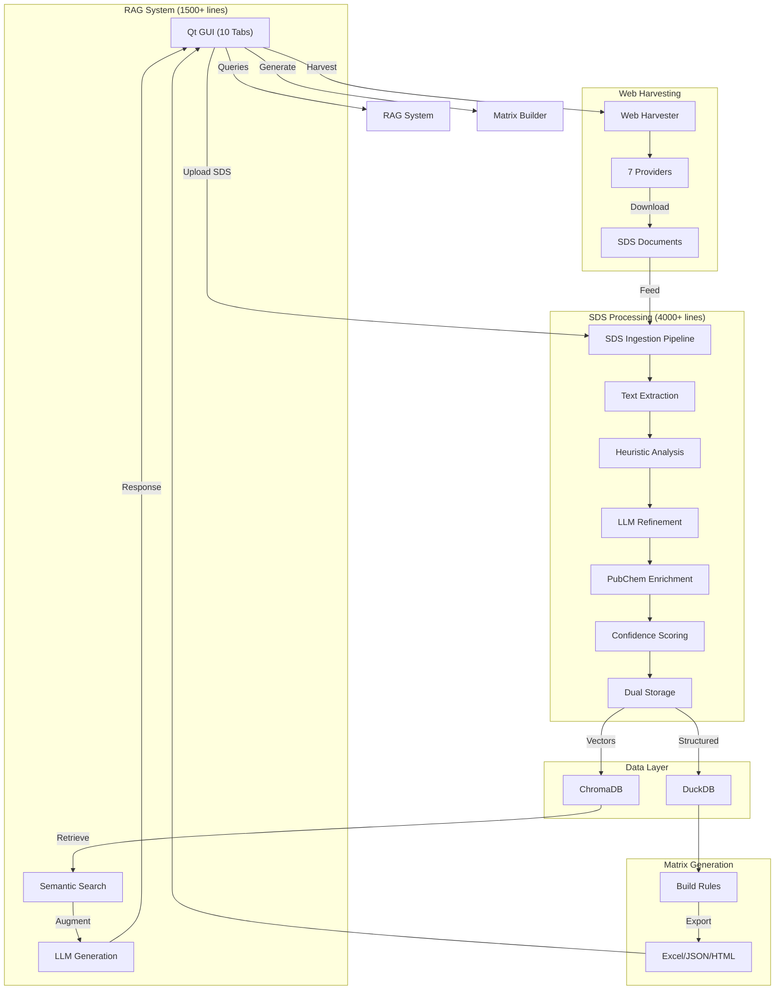

# RAG SDS Matrix

A comprehensive **Safety Data Sheet (SDS) processor** with a modern Qt GUI that extracts chemical safety information, generates compatibility matrices, and provides intelligent knowledge base management using a hybrid approach combining:

- 🔍 **Heuristic Extraction** (Regex patterns)
- 🤖 **LLM Refinement** (Local Ollama models)
- 🧪 **PubChem Enrichment** (Real-time validation)
- 🌐 **RAG Augmentation** (Vector search + semantic retrieval)
- 🚀 **Web Harvesting** (7 chemical supplier integrations)


---

## 🎯 Core Features

### ⚗️ Chemical Data Extraction
- **Multi-Format Input**: PDF, DOCX, TXT, Markdown
- **Hybrid Extraction**: Combines regex patterns + LLM refinement
- **Vendor Routing**: Automatic vendor-specific rule selection
- **Confidence Scoring**: Quality metrics for each extraction
- **GHS Classification**: Automatic hazard classification and H/P code assignment

### 🧪 Data Enrichment
- **PubChem Integration**: Real-time CAS validation and molecular data lookup
  - Validates CAS numbers, product names, molecular formulas
  - Fills missing: molecular weight, IUPAC names, structure identifiers
  - Enriches GHS H/P statements with complete hazard classifications
- **CAMEO Chemicals**: NOAA reactivity predictions (~3000+ chemicals)
- **Auto-Validation**: Cross-checks data consistency across sources

### 🔗 Knowledge Management
- **RAG System**: Vector embeddings + semantic search
  - Document ingestion with automatic chunking
  - Query tracking and analytics
  - Incremental model retraining
- **Dual Storage**: DuckDB (structured) + ChromaDB (vectors)
- **Decision Auditing**: Complete traceability with timestamps

### 🗺️ Compatibility Matrix
- **Automatic Generation**: N×N chemical incompatibility grids
- **Multi-Source Rules**: MRLP, CAMEO, and manual overrides
- **Hazard Elevation**: IDLH and environmental risk integration
- **Multi-Format Export**: Excel, JSON, HTML with styling

### 🕷️ Web Harvesting
- **7 Provider Integrations**: ChemicalBook, Fisher, VWR, TCI, ChemicalSafety, Chembink, Fluorochem
- **IP Protection**: Rate limiting, user-agent rotation, automatic retry with backoff
- **Deduplication**: Prevents duplicate SDS files
- **Inventory Sync**: Integration with chemical inventory systems

### 🎨 Modern Qt GUI (10 Tabs)
- 📊 **RAG Tab**: Knowledge base ingestion and management
- 🧪 **SDS Tab**: Batch document processing with progress tracking
- 📈 **Records Tab**: View and filter extracted chemical data
- 👁️ **Review Tab**: Spot-check and review extractions
- 💾 **Backup Tab**: Export RAG data (JSON/CSV)
- 💬 **Chat Tab**: Query knowledge base with LLM responses
- 🔧 **Regex Lab**: Test and optimize extraction patterns
- ⚙️ **Automation Tab**: Configure automated workflows
- 📊 **Status Tab**: System health and connection monitoring
- **Dark/Light theming**, **Async operations**, **Real-time logging**

---

## 🏗️ Architecture



---

## 🔄 Data Pipelines

### SDS Processing Pipeline (5 Stages)
```
Input: PDF, DOCX, TXT, Markdown
  ↓ [1] Text Extraction (pdfplumber, python-docx, pytesseract)
  ↓ [2] Heuristic Analysis (Regex patterns)
        ├ CAS numbers, UN codes, H/P codes
        └ Confidence scoring
  ↓ [3] LLM Refinement (Ollama - only if low confidence)
  ↓ [4] PubChem Enrichment (Molecular data, validation)
  ↓ [5] Storage
    ├→ DuckDB (structured data)
    └→ ChromaDB (vector embeddings)
```

### RAG Knowledge System
```
Documents → Ingestion → Chunking → Embedding → ChromaDB
Query → Semantic Search → Context Assembly → LLM → Response
                                             ↓
                                        Query Tracking
```

### Compatibility Matrix Generation
```
Chemicals (DuckDB) → Apply Rules → Hazard Elevation → Export
                                           ↓
                            (MRLP, CAMEO, Manual)
```

---

## 📊 Project Statistics

| Metric | Value |
|--------|-------|
| **Python Files** | 62 files (16,762 lines) |
| **Utility Scripts** | 24 scripts (5,903 lines) |
| **Test Files** | 19 files (1,200+ lines) |
| **Total Codebase** | 31,365+ lines |
| **Documentation** | 20+ guides (7,500+ lines) |
| **Dependencies** | 45+ packages |
| **UI Tabs** | 10 functional tabs |
| **Harvester Providers** | 7 integrations |

---

## 📂 Project Structure

```
RAG_SDS_MATRIX/
├── src/                              # Application code (62 files)
│   ├── config/                       # Settings & i18n
│   ├── database/                     # DuckDB persistence
│   ├── harvester/                    # Web scraping (8 files, 7 providers)
│   ├── matrix/                       # Compatibility matrices (3 files)
│   ├── models/                       # LLM integration
│   ├── rag/                          # Vector DB & retrieval (7 files)
│   ├── sds/                          # Chemical extraction (17 files, 4000+ lines)
│   │   ├── processor.py              # Main orchestrator
│   │   ├── extractor.py              # Multi-stage extraction
│   │   ├── heuristics.py             # Regex patterns
│   │   ├── confidence_scorer.py      # Quality metrics
│   │   ├── pubchem_enrichment.py     # PubChem API
│   │   └── validators/               # Data validation
│   ├── ui/                           # PySide6 Qt GUI (11+ files)
│   │   ├── app.py                    # Main window (2,345 lines)
│   │   ├── components/               # ✨ NEW: Reusable components
│   │   │   ├── workers.py            # Threading utilities
│   │   │   └── styled_widgets.py     # Styling functions
│   │   └── tabs/                     # ✨ NEW: Modular tabs
│   │       ├── __init__.py           # TabContext & BaseTab
│   │       └── backup_tab.py         # Template implementation
│   └── utils/                        # Utilities & logging
│
├── scripts/                          # Utility scripts (24 files)
│   ├── Ingestion:
│   │   ├── ingest_cameo_chemicals.py  # CAMEO data ingestion
│   │   ├── ingest_mrlp.py             # Incompatibilities
│   │   └── test_cameo_scraper.py
│   ├── Processing:
│   │   ├── sds_pipeline.py            # Batch processing
│   │   └── rag_sds_processor.py       # RAG-enhanced processing
│   ├── Management:
│   │   ├── rag_backup.py              # Data export
│   │   ├── status.py                  # System status
│   │   └── harvest_scheduler.py       # Scheduled harvesting
│   └── Analytics:
│       ├── analyze_extraction_performance.py
│       └── benchmark_llm_models.py
│
├── tests/                            # Test suite (19 files)
│   ├── test_sds_processor.py
│   ├── test_pubchem_enrichment.py
│   ├── test_matrix_building.py
│   └── test_end_to_end.py
│
├── guides/                           # User guides (7 files)
│   ├── CAMEO_INGESTION_GUIDE.md      # CAMEO setup & usage
│   ├── CAMEO_IP_PROTECTION.md        # Security best practices
│   ├── PUBCHEM_ENRICHMENT_GUIDE.md   # Data enrichment
│   └── ...
│
├── docs/                             # Technical docs (13 files)
│   ├── RAG_OPTIMIZATION_GUIDE.md     # Query tracking
│   ├── RAG_QUICK_START.md            # Quick reference
│   └── ...
│
├── bin/                              # Shell scripts (3 files)
│   ├── run_app.sh                    # Launch GUI
│   ├── process_sds_with_rag.sh       # RAG processing
│   └── run_sds_pipeline.sh           # Complete pipeline
│
├── archive/                          # Historical documentation
│   ├── implementation_notes/         # 9 feature summaries
│   ├── session_notes/                # 15 session notes
│   └── old_scripts/                  # Deprecated code
│
├── data/                             # Runtime data (auto-created)
│   ├── duckdb/                       # DuckDB files
│   ├── chroma_db/                    # ChromaDB vectors
│   ├── logs/                         # Application logs
│   └── output/                       # Export results
│
├── README.md                         # This file
├── CLEANUP_SUMMARY.md                # Recent improvements
├── REFACTORING_PLAN.md               # UI roadmap
├── FINAL_PROJECT_INVENTORY.md        # File listing
├── requirements.txt                  # Dependencies
└── .env.example                      # Config template
```

---

## 🧬 Technology Stack

| Category | Technologies |
|----------|--------------|
| **Language** | Python 3.11+ |
| **GUI** | PySide6 (Qt6) |
| **Databases** | DuckDB (structured), ChromaDB (vectors) |
| **LLM** | Ollama (local models) |
| **Document Processing** | pdfplumber, python-docx, pytesseract |
| **Data Science** | Pandas, NumPy, scikit-learn |
| **Chemistry** | RDKit |
| **NLP** | LangChain, spaCy |
| **Web** | BeautifulSoup4, Selenium, requests |
| **Testing** | pytest |
| **DevOps** | Docker, docker-compose |

---

## ⚙️ Installation

### Prerequisites
- Python 3.11+
- Ollama (https://ollama.ai)
- 4GB RAM minimum (8GB+ recommended)
- 10GB+ disk space

### Setup Steps
```bash
# 1. Clone
git clone https://github.com/rdmdelboni/RAG_SDS_MATRIX.git
cd RAG_SDS_MATRIX

# 2. Virtual environment
python -m venv .venv
source .venv/bin/activate  # Windows: .venv\Scripts\activate

# 3. Dependencies
pip install -r requirements.txt

# 4. Download Ollama models
ollama pull qwen2.5:7b-instruct-q4_K_M  # Main LLM
ollama pull qwen3-embedding:4b           # Embeddings

# 5. Configure
cp .env.example .env
# Edit .env with your settings
```

---

## 🚀 Usage

### Launch GUI Application
```bash
source .venv/bin/activate
python -m src.ui.app
```

### Process SDS Documents (CLI)
```bash
python scripts/sds_pipeline.py /path/to/sds/folder
```

### Ingest CAMEO Chemicals
```bash
python scripts/ingest_cameo_chemicals.py
```

### Check System Status
```bash
python scripts/status.py
```

---

## 🧪 Testing

```bash
pytest                    # Run all tests
pytest -v                 # Verbose
pytest --cov             # Coverage report
```

---

## 📚 Documentation

**For Users**:
- [CAMEO Setup Guide](guides/CAMEO_INGESTION_GUIDE.md)
- [PubChem Enrichment](guides/PUBCHEM_ENRICHMENT_GUIDE.md)

**For Developers**:
- [RAG Optimization Guide](docs/RAG_OPTIMIZATION_GUIDE.md)
- [UI Refactoring Plan](REFACTORING_PLAN.md)
- [Project Inventory](FINAL_PROJECT_INVENTORY.md)

---

## 📄 License

MIT License - see [LICENSE](LICENSE) for details.

---

**Version**: 1.2.0
**Last Updated**: December 4, 2025
**Status**: Active Development (UI Refactoring in Progress)
