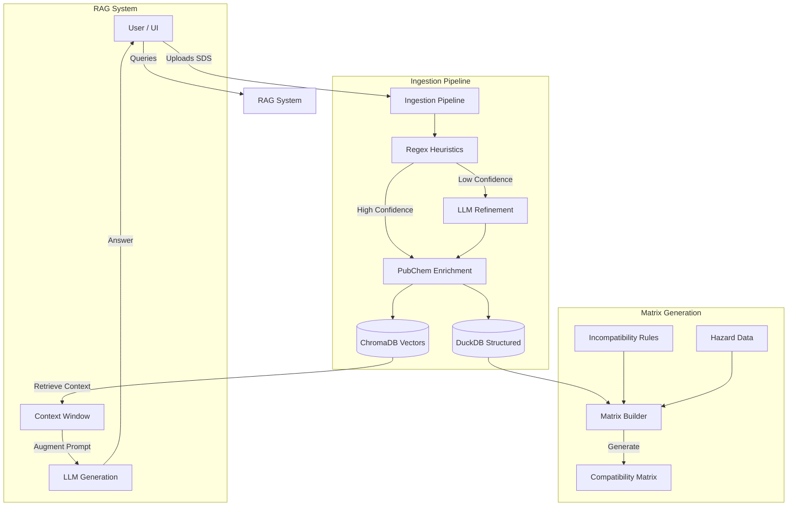

A RAG-enhanced Safety Data Sheet (SDS) processor that extracts chemical safety information and generates compatibility matrices using a hybrid approach combining heuristic extraction, LLM refinement, and RAG-augmented generation.


*(Placeholder: Add a banner image here showing the application running)*

## 🚀 Features

- **Hybrid Extraction Pipeline**: Combines regex heuristics, LLM refinement, PubChem enrichment, and RAG augmentation
- **PubChem Integration**: Automatic validation and enrichment using PubChem's chemical database
  - Validates CAS numbers, product names, and molecular formulas
  - Fills missing fields (molecular weight, IUPAC names, structure identifiers)
  - Enriches GHS hazard statements (H/P codes) with complete classifications
- **CAMEO Chemicals Integration**: Uses NOAA's CAMEO database for accurate reactivity predictions
- **Multi-format Support**: Process PDF, TXT, MD, and DOCX SDS documents
- **Chemical Compatibility Matrix**: Automatic generation of incompatibility matrices
- **Knowledge Base Management**: Build and query a vector database of chemical safety documentation
- **Decision Auditing**: Full traceability of compatibility decisions with justifications
- **Regex Lab**: Tool for testing and optimizing vendor-specific extraction patterns

## 📸 Visual Overview

### Main Dashboard
*(Placeholder: Screenshot of the main application window showing the tabs)*

### Matrix View
*(Placeholder: Screenshot of the generated compatibility matrix with color-coded cells)*

### RAG Search
*(Placeholder: Screenshot of the RAG search interface with a query and result)*

## 🏗️ Architecture

The system is built on a modular architecture separating the UI, data processing, and storage layers.



## 🔄 Workflows

### SDS Processing Pipeline

1.  **Text Extraction**: Converts PDF/DOCX to text
2.  **Heuristic Analysis**: Applies regex patterns to find CAS, UN numbers, and Hazards
3.  **LLM Refinement**: Uses local LLM (Ollama) to fix extraction errors if confidence is low
4.  **Enrichment**: Validates data against PubChem and CAMEO databases
5.  **Storage**: Saves structured data to DuckDB and vector embeddings to ChromaDB

### Matrix Generation Pipeline

1.  **Data Retrieval**: Fetches processed chemicals from DuckDB
2.  **Rule Application**: Applies incompatibility rules from:
    *   **MRLP**: Mixed Reactivity Logic Rules
    *   **CAMEO**: NOAA Reactivity Data
    *   **Manual Overrides**: User-defined rules
3.  **Hazard Elevation**: Checks IDLH and environmental risks
4.  **Matrix Construction**: Builds the N x N compatibility grid

## 📂 Project Structure

```
RAG_SDS_MATRIX/
├── main.py                 # Application entry point
├── requirements.txt        # Python dependencies
├── pytest.ini             # Test configuration
├── README.md              # This file
├── TODO.md                # Development tasks
│
├── src/                   # Source code
│   ├── config/           # Settings, constants, i18n
│   ├── database/         # DuckDB persistence
│   ├── harvester/        # Web scraping for SDS documents
│   ├── matrix/           # Compatibility matrix building
│   ├── models/           # Ollama LLM client
│   ├── rag/              # Vector store, chunking, retrieval
│   ├── sds/              # SDS extraction pipeline
│   ├── ui/               # PySide6/Qt interface
│   └── utils/            # Logging utilities
│
├── tests/                # Test suite
│   ├── test_heuristics.py
│   ├── test_matrix_builder.py
│   ├── test_sds_processor.py
│   └── ...
│
├── scripts/              # Python utility scripts
│   ├── ingest_mrlp.py   # Structured data ingestion
│   ├── fetch_sds.py     # SDS harvester
│   ├── sds_pipeline.py  # SDS processing pipeline
│   └── status.py        # System status check
│
├── bin/                  # Shell convenience scripts
│   ├── backup_rag.sh    # Quick RAG backup
│   ├── process_sds_with_rag.sh  # RAG-enhanced processing
│   └── run_sds_pipeline.sh      # Complete pipeline
│
├── guides/               # Feature documentation
│   ├── QUICK_START_GUIDE.md
│   ├── CAMEO_SETUP.md
│   ├── PUBCHEM_ENRICHMENT_GUIDE.md
│   └── ...
│
├── docs/                 # Technical documentation
│   ├── USAGE_GUIDE.md
│   ├── RAG_OPTIMIZATION_GUIDE.md
│   └── ...
│
├── examples/             # Example scripts
│   └── rag_tracking_example.py
│
├── packaging/            # Deployment configuration
│   └── packaging.md
│
├── archive/              # Historical documentation
│   ├── implementation_notes/
│   ├── session_notes/
│   └── old_scripts/
│
└── data/                 # Data directories (auto-created)
    ├── chroma_db/       # Vector database
    ├── duckdb/          # Structured database
    ├── logs/            # Application logs
    ├── input/           # Input documents
    └── output/          # Export results
```

## 📚 Documentation & Guides

We have organized documentation to help you get started:

- **[Guides](/guides/)**: User-friendly guides for specific features (CAMEO, PubChem, RAG).
- **[Technical Docs](/docs/)**: Deep dives into architecture and configuration.
- **[Scripts](/scripts/)**: Utility scripts for automation and maintenance.

## 🛠️ Installation

### 1. Clone and Setup

```bash
git clone https://github.com/rdmdelboni/RAG_SDS_MATRIX.git
cd RAG_SDS_MATRIX
python -m venv .venv
source .venv/bin/activate  # On Windows: .venv\Scripts\activate
```

### 2. Install Dependencies

```bash
pip install -r requirements.txt
```

### 3. Install Ollama Models

```bash
ollama pull qwen2.5:7b-instruct-q4_K_M
ollama pull llama3.1:8b
ollama pull qwen3-embedding:4b
```

### 4. Configure Environment

```bash
cp .env.example .env
# Edit .env with your settings
```

## 🚦 Usage

### Start the Application

```bash
python main.py
```

### Command Line Tools

The project includes several convenience scripts in the `bin/` directory:

- **Process SDS**: `./bin/process_sds_with_rag.sh /path/to/sds`
- **Run Pipeline**: `./bin/run_sds_pipeline.sh /path/to/sds`
- **Backup Data**: `./bin/backup_rag.sh`

## 🧪 Testing

Run the test suite to ensure everything is working:

```bash
pytest
```

## 🤝 Contributing

1. Fork the repository
2. Create a feature branch
3. Commit your changes
4. Push to the branch
5. Open a Pull Request

## 📄 License

This project is licensed under the MIT License - see the LICENSE file for details.

---

**Version**: 1.1.0  
**Last Updated**: December 3, 2025  
**Status**: Active Development 🚧
